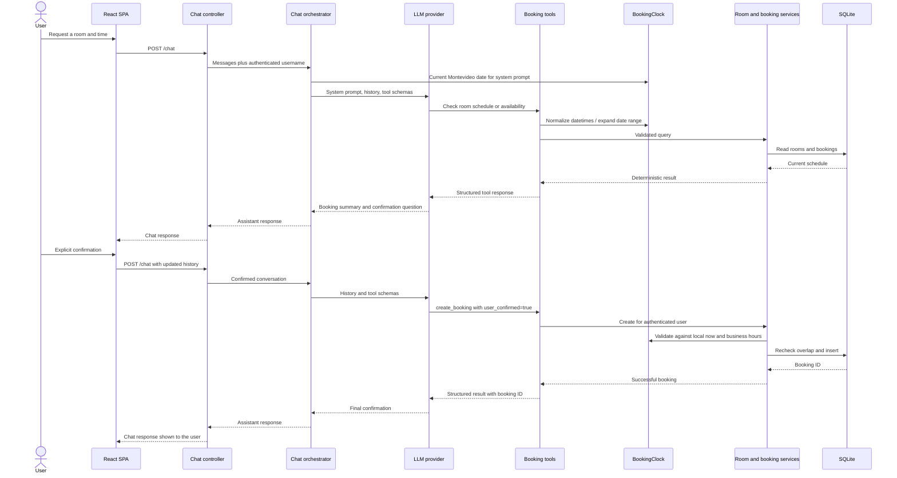

# Component diagram

This diagram follows a request from the browser through authentication, LLM
tool selection, deterministic booking services, persistence, and the response
shown to the user.

```mermaid
flowchart LR
    user[Authenticated user]

    subgraph frontend [React SPA]
        login[Login route]
        workspace[Workspace route]
        chatPanel[Chat panel]
        schedulePanel[Schedule panel]
        dateRange[Calendar date range helper]
        apiClient[Axios API client]
        queryClient[TanStack Query]
    end

    subgraph api [ASP.NET Core API]
        authController[Auth controller]
        chatController[Chat controller]
        roomsController[Rooms controller]
        authService[Auth service]
        orchestrator[Chat orchestrator]
        promptBuilder[System prompt builder]
        providerClients["LLM clients (Gemini, Groq, OpenRouter)"]
        bookingTools[Chat booking tools]
        datetimeNormalizer[ToolDateTimeNormalizer]
        bookingService[Booking service]
        roomService[Room service]
        bookingClock[IBookingClock]
        slotRules[SlotRules and BusinessCalendar]
        repositories[EF Core repositories]
        tokenService[JWT token service]
    end

    subgraph persistence [Persistence]
        sqlite[(SQLite database)]
    end

    subgraph external [External services]
        llmProvider[Configured LLM provider]
    end

    user --> login
    user --> workspace
    workspace --> chatPanel
    workspace --> schedulePanel
    login --> apiClient
    chatPanel --> apiClient
    schedulePanel --> dateRange
    dateRange --> queryClient
    queryClient --> apiClient

    apiClient -->|"login, refresh, logout"| authController
    apiClient -->|"POST /chat with httpOnly cookies"| chatController
    apiClient -->|"GET rooms and schedule fromDate/toDateExclusive"| roomsController

    authController --> authService
    authService --> tokenService
    authService --> repositories

    chatController --> orchestrator
    orchestrator --> promptBuilder
    promptBuilder --> repositories
    promptBuilder --> bookingClock
    orchestrator --> providerClients
    providerClients --> llmProvider
    llmProvider -->|"assistant text or tool call"| providerClients
    providerClients --> bookingTools
    bookingTools --> datetimeNormalizer
    datetimeNormalizer --> bookingClock

    bookingTools --> bookingService
    bookingTools --> roomService
    bookingService --> bookingClock
    bookingService --> slotRules
    roomService --> bookingClock
    roomService --> slotRules
    bookingService --> repositories
    roomService --> repositories
    roomsController --> roomService
    repositories --> sqlite

    bookingTools -->|"structured tool result"| providerClients
    providerClients -->|"final assistant response"| orchestrator
    orchestrator --> chatController
    chatController --> apiClient
    apiClient --> chatPanel
```

## Booking conversation sequence

## Trust boundaries

- The browser never supplies the booking owner; the API derives it from JWT
  claims.
- The LLM cannot access EF Core directly. It can only invoke declared tools.
- Services revalidate all arguments and database state regardless of model
  output.
- Schedule queries use Montevideo calendar dates (`fromDate` /
  `toDateExclusive`), expanded server-side via `IBookingClock`.
- Tokens are stored in httpOnly cookies and are not rendered by the frontend.
- Provider API keys and the JWT signing secret are backend environment values.
